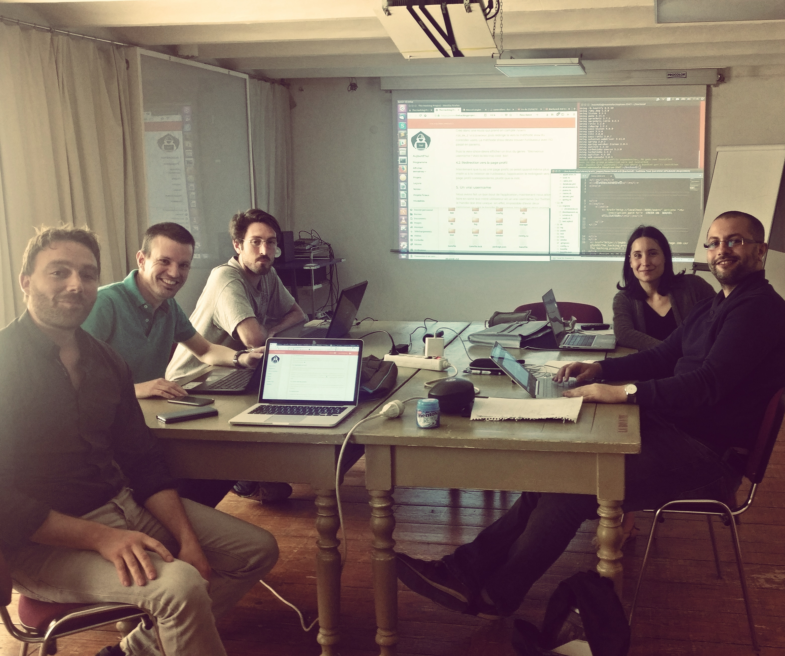

LENDINGPAGE.2 

================

[]
=> https://marseillewestcoast.herokuapp.com

-------------

# Introduction : Présentation de l'équipe

## ** WEST COAST MARSEILLE**

##- Audrey (@audreycouture)

##- Jerome (@Jerome)

##- Damien (@damien13005)

##- Maxime (@Maxime)

##- Sam (@sam)

##Fait en pair programming

-------------

# But de l´exercice

Pour ce Jeudi 17 Mai 2018 dans le cadre de l'approfondissement du langage HTML/CSS, nous devions créer plusieurs landing pages pour the hacking project.

Notre cahier des charges :

1) Donner de la forme à nos pages en intégrant un template WrapBootstrap
2) Faire plusieurs landing pages
3) Avoir un service de mailer, avec une newsletter de la bombe
4) Faire tourner nos opérations marketing grâce au Heroku Scheduler, pour avoir un afflux constant de personnes qui vont sur notre site

------------   

# Consignes d'utilisation

## Tests en local:

Pour ouvrir chaque app et la tester il faut downloader le dossier, se placer dedans dans votre terminal et lancer en commande:

> $ bundle install 

Pour voir la base données exécuter en commande un

> $ rails db:migrate

Puis tapez la commande suivante pour tester en local l'appli:

> $ rails server

La vous pouver vous balader sur notre code.

Puis ouvrir le fichier sqlite dans le dossier db de l'app, soit avec dbBrowser soit avec SqliteStudio ou autre et visionner.

et Tester la Version en Localhost en allant dans ton navigateur sur :

> localhost:3000

## Test en ligne:

Aller sur les liens Heroku suivants

> https://marseillewestcoast.herokuapp.com

------------

# Explications détaillés 

------------- choix du design  -------------

2 personnes ont disséqué  les ressources proposés pour retenir certains points clés : 
        ◦ Des éléments visuels attirants
        ◦ Ne pas trop charger la lending page
        ◦ Pas de Nav Bar (ainsi favoriser le call to action) 
        ◦ Attirer le clic et favoriser les contacts 

------------- comment le code a été fait : -------------

    1. Nouveau projet Rails : landing page
        a. $ rails new lendingpage.2
        b. Modif du gemfile (pour integration heroku ) 
    2. Nouveau Repo sur Github
        a. cd dossier lendingpage.2
        b. $ git init 
        c. $ git remote
        d. $ git Add . 
        e. $ git commit -m "first commit"
        f. $ git push 
    3. Heroku compatible
        a. $ heroku create
        b. $ git add .
        c. $ git commit -m "heroku"
        d. $ git push heroku master
        e. Succés avec site en ligne appelé https://marseillewestcoast.herokuapp.com
    4. Créer un compte Mailchimp 
        a. Créer un fichier .env avec les clées API de Mailchimp
        b. Dans le gitiniore rajouter le .env
        c. Sur mailchimp.com paramétrer avec le site heroku  
    5. Paramètrer la base de donner des utilisateurs 
        a. $ rails generate scaffold user email:string
        b. $ rails db:migrate
        c. Verif heroku comparabilité avec un nouveau push heroku => ok
        d. $ heroku run rails db:migrate => ok
        e. Affichage des routes users : $ rails routes 
        f. Vérification en ligne :   https://marseillewestcoast.herokuapp.com
    6. Configuration des pages en ligne en définissant seulement les routes 
        a. Dans config routes.rb :   
        b. $ verif avec rails routes => ok
        c. Verif avec heroku push (refaire étape 2def et 3bcd) => ok
    7. Ajout de Boostrap
        a. Insertion des liens boostrap dans application html  
    8. Mise en place d'un bot Instagram
    9. Mise en place d'un tracking avec Mixpanel

# Résultats

A vous de voir !

Merci pour la correction ! 
